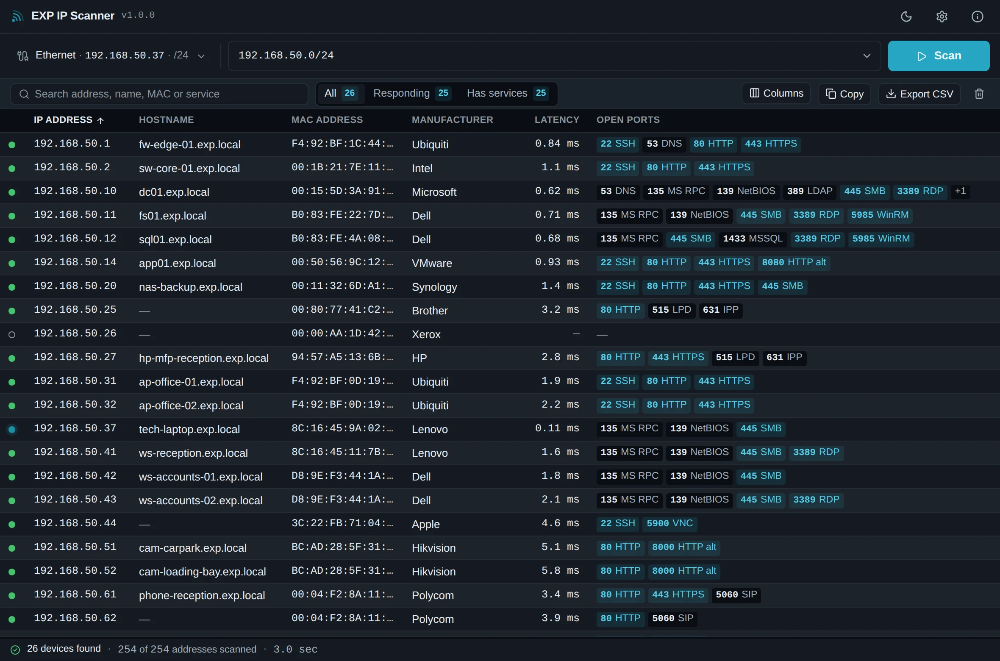

# EXP IP Scanner

**Find what's on the network. Fast.**

A free Windows network scanner from EXP Technical,
built for everyday IT work. It detects the network you are on, sweeps it in
seconds, and lets you open Remote Desktop, a file share, SSH or a device's web
interface straight from the results.

[Download](https://expipscanner.com/) ·
[What's new](https://expipscanner.com/releases.html) ·
[Privacy](https://expipscanner.com/privacy.html)



## What it does

- **Detects the network automatically.** Open it and the target is already
  filled in. The adapter ranking prefers a wired or wireless NIC over a Hyper-V
  switch, a Docker bridge or a VPN tunnel — and every adapter stays selectable,
  because sometimes the VPN really is what you meant.
- **Says where you are standing.** One line above the results: the adapter,
  this machine's address, the default gateway, the range about to be swept and
  the public IP address the site appears as from outside. Copy an individual
  address directly, or copy the whole network summary as one ticket-ready block.
- **Finds the quiet devices.** ICMP, TCP and the ARP cache together, with a
  second ARP pass, so printers, cameras and hardened workstations that ignore
  ping still appear — and appear again on the next scan rather than flickering
  in and out. No administrator rights needed.
- **Watches while you troubleshoot.** Watch Mode can repeat the scan every 5,
  10 or 30 seconds and highlight devices that appeared, changed or went offline.
  The comparison stays only in the current session and disappears when Watch
  Mode ends.
- **Names things.** Reverse DNS alongside the sweep, plus the full IEEE OUI
  registry built in, so manufacturers are identified offline on an isolated
  customer network.
- **Detects the services that matter.** 32 curated ports, shown as words:
  `445 SMB`, `3389 RDP`, `9100 Print`.
- **Opens the useful stuff fast.** Double-click any device for its full details
  drawer, or right-click for Remote Desktop, file shares, SSH, VNC, a web
  interface, ping, traceroute, and copy actions where they apply.
- **Gets the data out.** CSV that opens cleanly in Excel, or tab-separated rows
  that paste straight into a ticket.
- **Leaves nothing behind.** No inventory database, no scan history. Results
  live in memory until you export them.

## Download

Windows 10 and Windows 11, x64. Both editions are the same application.

| | Portable | Installer |
| --- | --- | --- |
| Installation | None — extract and run | Windows installer, all users |
| Administrator rights | Not needed | Needed to install |
| Scanning | Identical | Identical |
| Updates | Download the next ZIP | Quiet startup check + manual check |
| Start Menu entry | No | Yes |
| Scan data kept on disk | None | None |

**Portable is the recommended consultant download.** It runs from a USB stick,
a read-only share, a synced OneDrive folder or a tools folder, and never writes
to the folder it was extracted into. It is compiled without the updater at all,
rather than having the button hidden.

Both editions need the Microsoft Edge WebView2 Runtime, which ships with
Windows 11 and with current Windows 10.

Get them from the [website](https://expipscanner.com/) or the
[releases page](https://github.com/nazar-exp/EXP-IP-Scanner/releases). Each
release carries a `SHA256SUMS.txt`.

## Privacy

Scanning happens on your computer, and scan results are not uploaded anywhere.
There is no account, no telemetry, no analytics and no cloud service.

The application makes exactly two requests of its own. Neither sends scan
results or discovered-device data:

- **The public IP lookup** in the network summary asks a plain-text service what
  address this network appears as from outside. It runs when the window opens
  and when you press refresh, it is listed in the application's
  Content-Security-Policy so the window cannot reach anywhere else, and it can
  be turned off in Settings.
- **The update check**, in the installed edition only, asks GitHub Releases
  which stable version is current shortly after startup and when you press
  "Check now". If a signed updater manifest is available the app can install it
  in place; otherwise it opens the normal download page. The portable edition does not contain the
  updater at all.

The full notes are on the
[privacy page](https://expipscanner.com/privacy.html).

## Scope

EXP IP Scanner is a read-only network discovery and administration utility. It
does not attempt authentication, test credentials, exploit anything or change
any device it finds. Scan only networks you are authorised to inspect.

## Development

Requires [Node.js 22+](https://nodejs.org), a
[stable Rust toolchain](https://rustup.rs) and the
[Tauri prerequisites](https://tauri.app/start/prerequisites/) for your platform.

```bash
npm ci
npm run tauri:dev        # the desktop application, with hot reload
npm run dev              # the interface alone, in a browser, against the demo network
```

`npm run dev` needs no Rust build and no real network: the frontend falls back
to a built-in demo backend whenever the Tauri bridge is absent. That is what the
website's screenshots are captured from, so they can never show an older UI than
the one that ships.

### Checks

```bash
npm run typecheck        # TypeScript, strict
npm test                 # 223 frontend and packaging tests
npm run build            # production frontend build

cd src-tauri
cargo fmt --check
cargo test               # 99 backend tests
cargo clippy --all-targets -- -D warnings

# The portable edition is a different binary and is checked in its own right.
CARGO_TARGET_DIR=target-portable cargo test --no-default-features --features portable
```

Two end-to-end suites drive the real thing in a browser:

```bash
npm run build && npm run preview &
npm i --no-save playwright
npm run verify-ui        # 46 checks against the assembled interface

npx serve site -l 4174 &
npm run verify-site      # 23 checks against the website
```

### Builds

```bash
npm run tauri:build -- --target x86_64-pc-windows-msvc --bundles nsis

# The portable edition. Built with cargo rather than the Tauri CLI because the
# CLI has no --no-default-features, and turning the defaults off is the point:
# `installed-updater` is a default feature.
cd src-tauri
CARGO_TARGET_DIR=target-portable cargo build --release \
  --target x86_64-pc-windows-msvc --no-default-features --features portable,custom-protocol
cd ..
node scripts/package-portable.mjs --version 1.2.0 --target x86_64-pc-windows-msvc \
  --binary src-tauri/target-portable/x86_64-pc-windows-msvc/release/exp-ip-scanner.exe \
  --out artifacts
node scripts/verify-portable-zip.mjs --zip artifacts/EXP-IP-Scanner_1.2.0_windows-x64-portable.zip \
  --architecture x64 --version 1.2.0
```

### Regenerating assets

```bash
npm run screenshots                    # drives the real UI, then converts to WebP
python3 scripts/generate-icons.py      # every icon size from one master
python3 scripts/trace-logo.py          # re-vectorise the logo (needs potrace)
python3 scripts/generate_oui.py        # refresh the embedded IEEE OUI registry
```

## Architecture

```
src/                     React 19 + TypeScript, strict
  components/            One screen, composed from focused pieces
  hooks/                 useScan (streaming), usePublicIp, useSettings, useTheme
  lib/                   api (the only Tauri boundary), table, live, export,
                         actions, format, prefs, publicip, demo (the browser
                         backend)
  test/                  Realistic mock devices, shared by the tests
src-tauri/src/
  scanner.rs             Probing, ARP, cancellation, concurrency, event streaming
  ipparse.rs             CIDR, ranges and single addresses
  netinfo.rs             Interface detection, ranking and gateways
  ports.rs               The default service set and the service names
  oui.rs + oui_data.tsv  The embedded IEEE registry
  launch.rs              Consultant actions, and the validation boundary
  commands.rs            The Tauri command surface
  runtime.rs             Which edition this is, and where preferences live
site/                    The static download website
brand/                   The supplied logo, and the SVG traced from it
scripts/                 Version sync, packaging, verification, screenshots
```

Two decisions shape the rest:

**There is no database.** Scan results exist in memory until the window closes
or a CSV is exported. That keeps one customer's device list out of the next
site visit, and it is what makes the portable edition simple — there is no data
store to relocate, clean up or leave behind.

**The backend is the authority.** Targets, port lists and limits are validated
in Rust, and the frontend asks rather than reimplementing the rules. The
interface may pre-parse for immediate feedback, but nothing reaches a probe
loop or a launcher without passing the Rust check first.

### Editions

The edition is a compile-time Cargo feature, never inferred at runtime:

- `--features installed-updater` (the default) links the Tauri updater.
- `--no-default-features --features portable` links no updater at all and puts
  the WebView profile under the user's local application data, so the folder
  the executable sits in is never written to.

Enabling both is a compile error, and CI checks that the guard is wired.

## Releases

Bump `version` in `package.json`, run `npm run sync-version`, and merge to
`main`. The release workflow then builds the installer and the portable ZIP on a
Windows runner, verifies the ZIP holds the portable build for the right
architecture, generates checksums and publishes the GitHub release. The website
picks up the new version and file sizes from the GitHub API without being
edited.

`package.json` is the single source of truth for the version, and CI fails if
`Cargo.toml`, the Tauri config or the website has drifted from it.

### One-time setup

Auto-update for the installed edition is signed with Tauri's updater key. The
public key is compiled into the installed application; the matching private key
lives only in GitHub Actions as `TAURI_SIGNING_PRIVATE_KEY` (with
`TAURI_SIGNING_PRIVATE_KEY_PASSWORD` when the key is password-protected).

Starting with 1.1.4, release publishing requires signing to be configured. A
release will fail before publishing rather than produce an installer that
installed copies cannot trust. The portable edition still contains no updater.

GitHub Pages needs to be switched on once: **Settings → Pages → Source: GitHub
Actions**.

## Licence

MIT. See [LICENSE](LICENSE).
